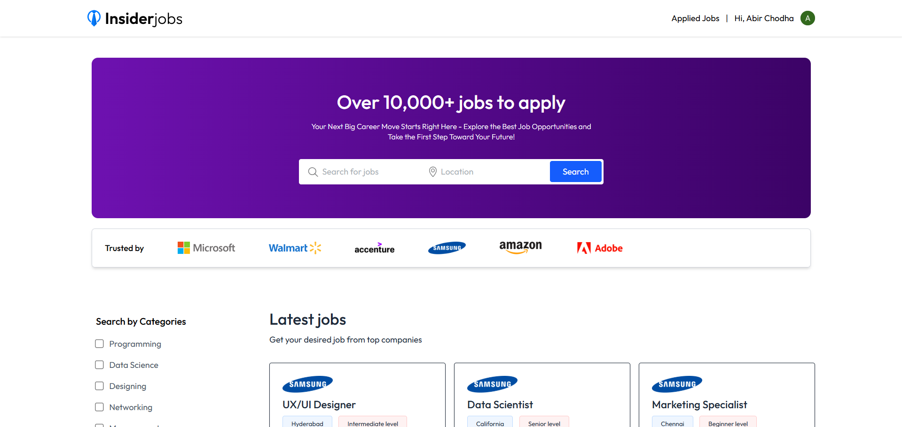
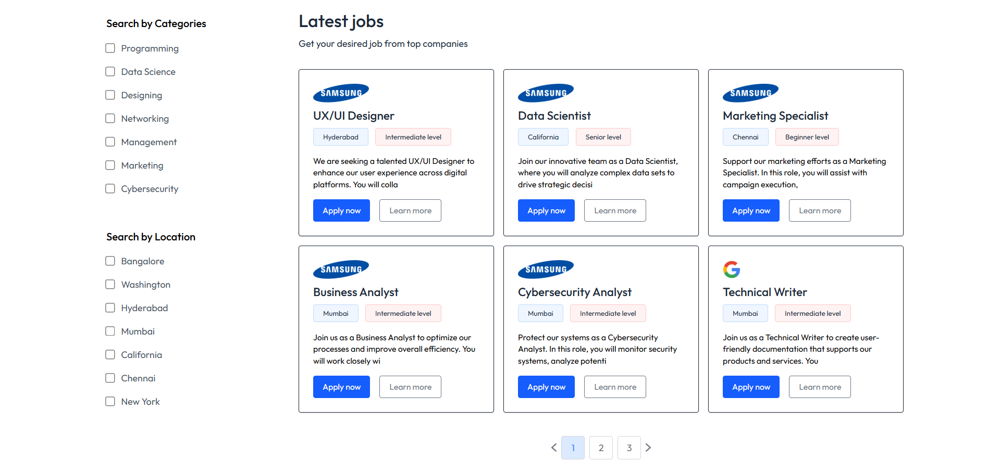
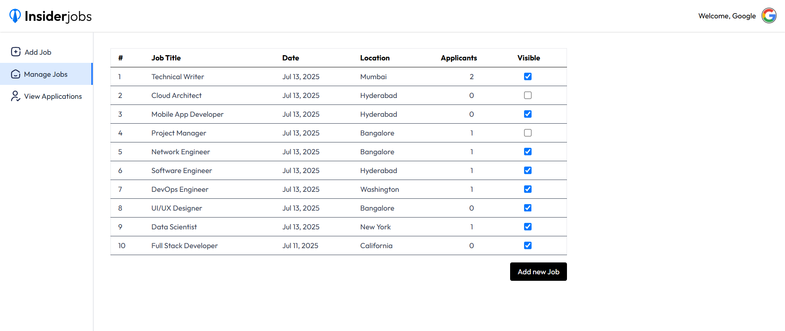

# 💼 Job Portal - Full Stack MERN Application

A modern, feature-rich job portal application built with the MERN stack, enabling seamless connections between job seekers and recruiters. This platform offers intuitive job searching, application tracking, and comprehensive recruiter management tools.


## 🌟 Features

### For Job Seekers

- **Smart Job Search**: Search and filter jobs by title, location, category, and experience level
- **One-Click Apply**: Quick application process with resume upload
- **Application Tracking**: Monitor application status (Pending/Accepted/Rejected)
- **Profile Management**: Update resume and personal information
- **Responsive Design**: Seamless experience across all devices

### For Recruiters

- **Company Dashboard**: Comprehensive recruiter control panel
- **Job Posting**: Create and manage job listings with rich text descriptions
- **Applicant Management**: Review applications and manage candidate status
- **Job Visibility Control**: Toggle job post visibility
- **Application Analytics**: Track applicant count per job posting

### General Features

- **User Authentication**: Secure authentication powered by Clerk
- **File Upload**: Cloud-based resume storage via Cloudinary
- **Real-time Updates**: Dynamic content updates without page reload
- **Rich Text Editor**: Quill-powered job description editor
- **Modern UI**: Clean, intuitive interface built with Tailwind CSS

## 🚀 Tech Stack

### Frontend

- **React.js** - UI library for building interactive interfaces
- **Vite** - Next-generation frontend tooling
- **Tailwind CSS** - Utility-first CSS framework
- **Clerk** - Authentication and user management
- **Axios** - HTTP client for API requests
- **React Router** - Client-side routing
- **Quill** - Rich text editor
- **Moment.js** - Date formatting and manipulation
- **React Toastify** - Toast notifications

### Backend

- **Node.js** - JavaScript runtime
- **Express.js** - Web application framework
- **MongoDB** - NoSQL database
- **Mongoose** - MongoDB object modeling
- **Cloudinary** - Cloud-based media management
- **JWT** - JSON Web Tokens for authentication
- **Bcrypt** - Password hashing
- **Multer** - File upload handling
- **Sentry** - Error tracking and monitoring

## 📁 Project Structure

```
job-portal/
├── client/                    # Frontend React application
│   ├── src/
│   │   ├── assets/           # Images, icons, and static assets
│   │   ├── components/       # Reusable React components
│   │   │   ├── AppDownload.jsx
│   │   │   ├── Footer.jsx
│   │   │   ├── Hero.jsx
│   │   │   ├── JobCard.jsx
│   │   │   ├── JobListing.jsx
│   │   │   ├── Loading.jsx
│   │   │   ├── Navbar.jsx
│   │   │   └── RecruiterLogin.jsx
│   │   ├── context/          # React Context for state management
│   │   │   └── AppContext.jsx
│   │   ├── pages/            # Application pages
│   │   │   ├── AddJob.jsx
│   │   │   ├── Applications.jsx
│   │   │   ├── ApplyJob.jsx
│   │   │   ├── Dashboard.jsx
│   │   │   ├── Home.jsx
│   │   │   ├── ManageJobs.jsx
│   │   │   └── ViewApplications.jsx
│   │   ├── App.jsx           # Main application component
│   │   ├── index.css         # Global styles
│   │   └── main.jsx          # Application entry point
│   ├── index.html
│   └── vite.config.js        # Vite configuration
│
└── server/                    # Backend Node.js application
    ├── config/               # Configuration files
    │   ├── cloudinary.js     # Cloudinary setup
    │   ├── db.js             # MongoDB connection
    │   ├── instrument.js     # Sentry configuration
    │   └── multer.js         # File upload configuration
    ├── controllers/          # Request handlers
    │   ├── companyController.js
    │   ├── jobController.js
    │   ├── userController.js
    │   └── webhooks.js
    ├── middleware/           # Custom middleware
    │   └── authMiddleware.js
    ├── models/               # MongoDB schemas
    │   ├── Company.js
    │   ├── Job.js
    │   ├── JobApplication.js
    │   └── User.js
    ├── routes/               # API routes
    │   ├── companyRoutes.js
    │   ├── jobRoutes.js
    │   └── userRoutes.js
    ├── utils/                # Utility functions
    │   └── generateToken.js
    └── server.js             # Server entry point
```

## 🛠️ Installation & Setup

### Prerequisites

- Node.js (v16 or higher)
- MongoDB (local or Atlas)
- Clerk account for authentication
- Cloudinary account for file storage

### Environment Variables

Create a `.env` file in the `server` directory:

```env
# Server Configuration
PORT=5000

# Database
MONGODB_URI=your_mongodb_connection_string

# JWT
JWT_SECRET=your_jwt_secret_key

# Clerk
CLERK_WEBHOOK_SECRET=your_clerk_webhook_secret

# Cloudinary
CLOUDINARY_NAME=your_cloudinary_name
CLOUDINARY_API_KEY=your_cloudinary_api_key
CLOUDINARY_SECRET_KEY=your_cloudinary_secret_key

# Sentry (Optional)
SENTRY_DSN=your_sentry_dsn
```

Create a `.env` file in the `client` directory:

```env
# Clerk
VITE_CLERK_PUBLISHABLE_KEY=your_clerk_publishable_key

# Backend API
VITE_BACKEND_URL=http://localhost:5000
```

### Installation Steps

1. **Clone the repository**

   ```bash
   git clone https://github.com/yourusername/job-portal.git
   cd job-portal
   ```

2. **Install server dependencies**

   ```bash
   cd server
   npm install
   ```

3. **Install client dependencies**

   ```bash
   cd ../client
   npm install
   ```

4. **Start the development servers**

   Terminal 1 (Backend):

   ```bash
   cd server
   npm start
   ```

   Terminal 2 (Frontend):

   ```bash
   cd client
   npm run dev
   ```

5. **Access the application**
   - Frontend: `http://localhost:5173`
   - Backend API: `http://localhost:5000`

## 📝 API Endpoints

### Job Routes

- `GET /api/jobs` - Get all visible jobs
- `GET /api/jobs/:id` - Get single job by ID

### User Routes

- `GET /api/users/user` - Get user data
- `POST /api/users/apply` - Apply for a job
- `GET /api/users/applications` - Get user's applications
- `POST /api/users/update-resume` - Update user resume

### Company Routes

- `POST /api/company/register` - Register new company
- `POST /api/company/login` - Company login
- `GET /api/company/company` - Get company data
- `POST /api/company/post-job` - Post a new job
- `GET /api/company/applicants` - Get all applicants
- `GET /api/company/list-jobs` - Get company's posted jobs
- `POST /api/company/change-status` - Update application status
- `POST /api/company/change-visibility` - Toggle job visibility

### Webhooks

- `POST /webhooks` - Clerk user management webhook

## 🎨 Key Features Implementation

### Authentication Flow

- Job seekers authenticate via Clerk (social login support)
- Recruiters use custom JWT-based authentication
- Separate authentication flows for different user types

### File Upload System

- Resume uploads handled via Multer
- Files stored securely on Cloudinary
- Automatic file optimization and CDN delivery

### Job Application Process

1. User searches and filters jobs
2. Views detailed job description
3. One-click apply (with resume check)
4. Real-time application status updates

### Recruiter Dashboard

1. Post jobs with rich text descriptions
2. View and manage all applications
3. Accept/Reject candidates
4. Toggle job visibility
5. Track application metrics

## 🚀 Deployment

### Frontend (Vercel/Netlify)

1. Build the client:
   ```bash
   cd client
   npm run build
   ```
2. Deploy the `dist` folder to your hosting platform
3. Update environment variables in hosting dashboard

### Backend (Heroku/Railway/Render)

1. Ensure all environment variables are set
2. Deploy using Git or Docker
3. Update CORS settings for production frontend URL

## 🤝 Contributing

Contributions are welcome! Please follow these steps:

1. Fork the repository
2. Create a feature branch (`git checkout -b feature/AmazingFeature`)
3. Commit your changes (`git commit -m 'Add some AmazingFeature'`)
4. Push to the branch (`git push origin feature/AmazingFeature`)
5. Open a Pull Request

## 👨‍💻 Developer

**Abir Chodha**

- GitHub: [@abir2907](https://github.com/abir2907)
- LinkedIn: [Abir Chodha](https://www.linkedin.com/in/abir-chodha-46a983298/)
- Portfolio: [yourportfolio.com](https://yourportfolio.com)

## 🙏 Acknowledgments

- [Clerk](https://clerk.com/) for authentication services
- [Cloudinary](https://cloudinary.com/) for media management
- [MongoDB Atlas](https://www.mongodb.com/cloud/atlas) for database hosting
- [Tailwind CSS](https://tailwindcss.com/) for styling utilities

## 📸 Screenshots

### Home Page



### Job Listings



### Recruiter Dashboard



---

⭐ **Star this repository if you find it helpful!**
